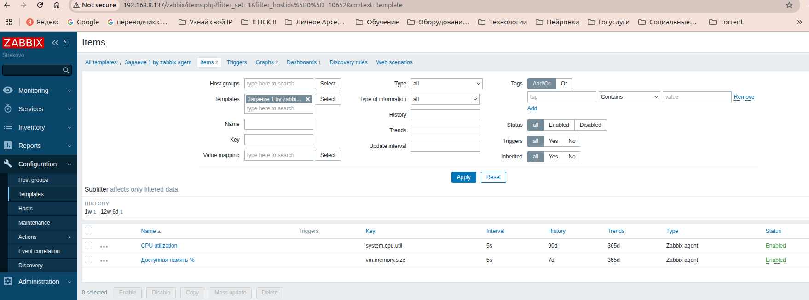

# Домашнее задание к занятию   
**"`Система мониторинга Zabbix. Часть 2`"** - `Воскобойников Арсений Петрович`
   

# **Задание 1**  

Создайте свой шаблон, в котором будут элементы данных, мониторящие загрузку CPU и RAM хоста.

Процесс выполнения:  
Выполняя ДЗ сверяйтесь с процессом отражённым в записи лекции.
В веб-интерфейсе Zabbix Servera в разделе Templates создайте новый шаблон.  
- Создайте Item который будет собирать информацию об загрузке CPU в процентах  
- Создайте Item который будет собирать информацию об загрузке RAM в процентах  
**Требования к результату:**  
- Прикрепите в файл README.md скриншот страницы шаблона с названием «Задание 1»

**Ответ**  
Скриншот страницы шаблона с названием «Задание 1». Для создания ITEM  использовались ключи из шаблона "Linux by zabbix agent"


# **Задание 2**  
Добавьте в Zabbix два хоста и задайте им имена <фамилия и инициалы-1> и <фамилия и инициалы-2>. Например: ivanovii-1 и ivanovii-2.

Процесс выполнения:  
Выполняя ДЗ сверяйтесь с процессом отражённым в записи лекции:
- Установите Zabbix Agent на 2 виртмашины, одной из них может быть ваш Zabbix Server  
- Добавьте Zabbix Server в список разрешенных серверов ваших Zabbix Agentов  
- Добавьте Zabbix Agentов в раздел Configuration > Hosts вашего Zabbix Servera  
- Прикрепите за каждым хостом шаблон Linux by Zabbix Agent  
- Проверьте что в разделе Latest Data начали появляться данные с добавленных агентов  
**Требования к результату**  
- Результат данного задания сдавайте вместе с заданием 3

# **Задание 3**  
- Привяжите созданный шаблон к двум хостам. Также привяжите к обоим хостам шаблон Linux by Zabbix Agent.  
**Процесс выполнения:**  
- Выполняя ДЗ сверяйтесь с процессом отражённым в записи лекции.
- Зайдите в настройки каждого хоста и в разделе Templates прикрепите к этому хосту ваш шаблон  
- Так же к каждому хосту привяжите шаблон Linux by Zabbix Agent  
- Проверьте что в раздел Latest Data начали поступать необходимые данные из вашего шаблона  
**Требования к результату**  
- Прикрепите в файл README.md скриншот страницы хостов, где будут видны привязки шаблонов с названиями «Задание 2-3». Хосты должны иметь зелёный статус подключения.

# **Ответ на задание 2 и 3**

```
Создадим 2 хоста, добавим на них забикс агента.  Закрепим шаблон Linux by Zabbix Agent
```

в latest data отражается информация, что данные по хостам поступают.


Добавим ранее созданые шаблон со снятием данных по ЦП и оперативной памяти к нашим хостам:  
  
Поскольку мы использовали ключи "system.cpu.util" и "vm.memory.size", которые используются в шаблоне Linux by Zabbix Agent, то использовать эти 2 шаблона (наш и типовой) одновременно нельзя.  
Для решения есть ряд вариантов. Остановимся на добавлении custom items.
Пропишем дополнительнительные данные на агентах Zabbix:

```
sudo nano /etc/zabbix/zabbix_agentd.d/userparams.conf

UserParameter=custom.cpu.load,top -bn1 | grep "Cpu(s)" | awk '{print 100 - $8}'
UserParameter=custom.ram.load,free | awk '/Mem:/ {printf("%.2f", $3/$2 * 100)}'
```
Теперь можно добавить одновременно 2 шаблона к одному хосту:  
  
Видно, что данные собираются по всем шаблонам.
  

# **Задание 4**  
Создайте свой кастомный дашборд.  
Процесс выполнения:  
- Выполняя ДЗ сверяйтесь с процессом отражённым в записи лекции.
- В разделе Dashboards создайте новый дашборд
- Разместите на нём несколько графиков на ваше усмотрение.
- Требования к результату  
- Прикрепите в файл README.md скриншот дашборда с названием «Задание 4»  
**Ответ**    
Создадим дашборд. Выведем на него графики загрузки памяти и процессора от 2 тестовых хостов:
